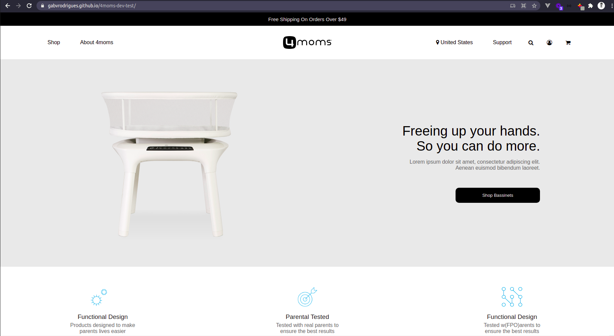

# X-Team Development Test (4moms)
This project is a 4moms's homepage clone developed using just HMTL and CSS - based on a [flexbox](https://www.w3schools.com/css/css3_flexbox.asp), with no frameworks. The work preview can be accessed on the link below:

## [Work Preview](https://gabvrodrigues.github.io/4moms-dev-test/)

## To develop
Due the time limit of this test, some features and improvements could not be developed and based on the UI prototype could be developed:
- Finish the dropdown menu development
- Open the search bar on click on the search icon in the navbar
- Mobile version (including a side bar menu and reponsive layout that a mobile version needs)
- Some animations on menus and on hover buttons and banners
- Tweaks in the spacing and font sizes